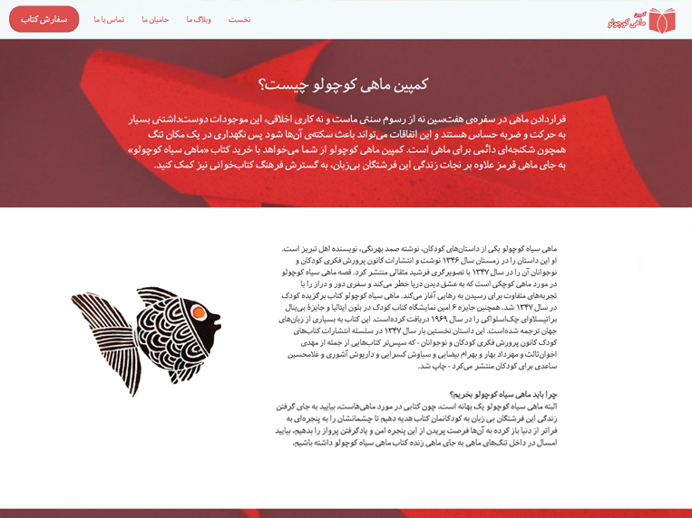

# Lightboard
Lightboard is a free, light, modern, responsive and Open-Source wordpress theme

## How to Download
This is a old-school project and still have some bugs, Use it by your own risk or if you're a developer and can fix this bugs by yourself.

Checkout releases page https://github.com/arazgholami/lightboard/releases

## Contribution
Any contribution are welcome.

## Authors
Back to 2014, this theme designed by Daniel Yavari for Shelfinfo project (RIP). And it's coded by me as front-end developer of team. So after 4 years, I decided to publish theme as a open-srouce project.

Araz Gholami <https://arazgholami.com>

## License
MIT

## Contact
Araz Gholami contact@arazgholami.com 

## Changelogs
### v0.1
- Minimal, Moden and Responsive Layout
- Minimum size & minimum HTTP request
